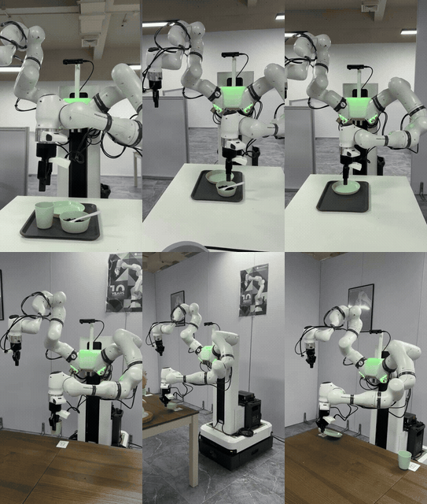

# Standalone object grasp tests

This entry starts with the robot already stationary beside the pickup table and
isolates one object grasp from base navigation and letter delivery.  It reuses
the same perception, alignment, descent, gripper ordering, and lift components
used by the Shanghai-validated Stage 1 mission; it does not reimplement those
actions.

## Scope

- Select one object: `cup`, `bowl`, or `plate`.
- The default operation is `pick`: finish with the selected object held.
- Optional `pick-place` returns it to the same pickup location for a release
  test.
- No base command is issued.
- Dry-run is the default and prints the selected component sequence.
- Physical execution requires an explicit `--execute --fresh-start-confirmed`.

The robot must already be stationary beside the calibrated pickup table, the
three objects must be in their normal pickup area, both grippers must be empty,
and the Shanghai robot services must be healthy.  After initialization, the
standard left-arm top pose gives the left wrist camera a useful overview of the
cup, food bowl, and plate.  The selected object detector then uses fresh frames
from that view and aligns only the requested object.

Hamburg table height and room geometry have not been measured against Shanghai.
The Shanghai lifting-column target and object descent profiles are references,
not authorized Hamburg motion settings.

## Commands

Run on the arm computer from the repository root after sourcing the deployed
environment through the configured launcher:

```bash
# Inspect without motion.
python3 mission/scripts/run_standalone_grasp_test.py \
  --object cup

# Cup: initialize, detect, align, pick, and hold.
python3 mission/scripts/run_standalone_grasp_test.py \
  --object cup --execute --fresh-start-confirmed

# Food bowl: initialize, detect, align, pick, and hold.
python3 mission/scripts/run_standalone_grasp_test.py \
  --object bowl --execute --fresh-start-confirmed

# Plate: initialize, detect, align, pick, and hold.
python3 mission/scripts/run_standalone_grasp_test.py \
  --object plate --execute --fresh-start-confirmed
```

The program returns success only after the selected object is raised and the
left arm has restored a stable hold.  Add `--operation pick-place` only when a
same-location release test is wanted.  It writes a phase state file and per-phase logs under
`~/.tmr_standalone_grasp_test/`, and uses one motion lock so two tests cannot
run concurrently.

## Required right-arm posture for the plate

Every standalone test first runs the same dual-arm initializer used by the
complete mission.  For the plate test this is mandatory: the right arm is moved
first to the configured raised, inward, retracted parking shape and its gripper
is kept closed; the left arm is then restored to its calibrated pick-top pose.
Only the left arm performs the object grasp.

Shanghai can guarantee this precondition because the tested initializer always
sends both configured joint targets and accepts success only after fresh
measured joint states prove both arms are within the stored tolerance.  The
authoritative posture is `grasp/config/grasp_initial_state.yaml`; the runner
does not rely on a remembered visual pose or a previous process state.

These executable commands are Shanghai-only. On Hamburg Humble, the executable
runner refuses to start because its MoveIt/PTP, Robotiq action and camera
snapshot interfaces are not established there. Use
`deploy/hamburg/run_hamburg.sh grasp-check --object cup|bowl|plate` for the
read-only native interface and object-visibility check. It does not grasp or
place an object; physical Hamburg grasp testing remains locked until a
single-node controller and contact verification are validated on the venue.

## Demonstrated motions



Asset SHA-256:
`18c2d6b1006bbdddda2dd06f5da02bd775d5f3b3abeac0cea406aa68eb9f7629`.
